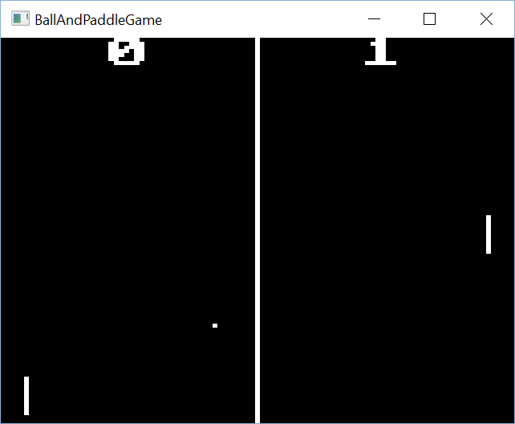

jalleg - JVM Binding for Allegro
================================

* Inception: May 2016
* Current Release: 0.1, javadocs:
  [jalleg-binding](http://gillius.github.io/jalleg/docs/jalleg-binding/0.1/),
  [jalleg-framework](http://gillius.github.io/jalleg/docs/jalleg-framework/0.1/)
* Development Version: 0.2-SNAPSHOT on OSSRH (see [Getting Started](#using-snapshots))

jalleg is a JVM binding for [Allegro](http://liballeg.org/) 5.2 to be used by any
[JVM language](https://en.wikipedia.org/wiki/List_of_JVM_languages)
(Java obviously, but also other languages such as Groovy, Kotlin, JavaScript, Scala, Jython, JRuby, and Clojure). Java
7 and higher (up to Java 11 tested) are supported; however, the jalleg-framework will be updated to require Java 8 if a
situation calls for lambdas.

From the Allegro site: Allegro is a cross-platform library mainly aimed at video game and multimedia programming. It
handles common, low-level tasks such as creating windows, accepting user input, loading data, drawing images, playing
sounds, etc.

(Note: JavaScript on JVM does not mean it can run in a browser. If you want a true JS port of Allegro, check out
[Allegro.js](http://allegrojs.net/))

This project was inspired to build a modern version of a very old project,
[JAllegro](https://sourceforge.net/projects/jallegro/) by Kazzmir.

The binding uses the [JNA library](https://github.com/java-native-access/jna) to call the native code. The bindings were
generated in part from the [JNAerator](http://jnaerator.googlecode.com/) project, then manipulated to fit the needs and
style for jalleg.

Allegro was a library I originally worked with a lot when I was learning C/C++ development in DOS in the late 1990s, and
has always had a special meaning to me. Allegro 5 is a modern, cross-platform variation of the library supporting hardware
rendering and even mobile development. Allegro is a simple library to use and programming a game is a great way to get
into learning programming. My hope is that jalleg expands the Allegro fun to Java and all the JVM languages.

Features / Status
-----------------

Besides the direct binding, jalleg provides a framework around Allegro with the following currently implemented features:
* Automatically unpack and load Allegro DLL for you (Win64 only currently)
* Basic game loop / initialization
* Statistics tracking (rendered frames/sec, logic frames/etc, percentage idle time, etc.)
* Ability to load Allegro resources and create memfiles from JARs and Java byte arrays
* "Retro" audio system capable of generating and playing square, triangle, sawtooth, sine waves or user-defined waveforms

### How you can help

* If you know how to build a static-link liballegro_monolith on Linux, I can make an "rt" for it.
* Test jalleg on OS X
* It would be nice if someone can demonstrate that jalleg can work on Android as I suspect it should.
* Contribute examples for the bindings not yet tested.

### Binding Status

Almost all of the Allegro API is mapped. Some of the API is mapped but hasn't been tested yet. See
[BindingStatus](https://github.com/gillius/jalleg/blob/master/jalleg-binding/BindingStatus.md) for more details.

Getting Started
---------------

There are 3 libraries built by the project:

1. **jalleg-binding:** Contains the JNA-based bindings themselves to load and use the Allegro library.
3. **jalleg-framework:** framework to make using the binding from Java easier and to support the examples.
4. **jalleg-examples:** An example project using jalleg-binding and jalleg-rt.

A companion project, [jalleg-rt](https://github.com/gillius/jalleg-rt), provides a pre-built runtime for Java 64 bit on Windows. If you want to run jalleg on Ubuntu, the easiest way
is to [install from the PPA](https://wiki.allegro.cc/index.php?title=Install_Allegro_from_Ubuntu_PPAs). Jalleg will
search for liballegro.so automatically on the normal ldpaths. If you build
Allegro yourself (use WANT_MONOLITH), set AL_NAME environment variable, an example being:
`export AL_NAME=/home/me/allegro/build/lib/liballegro_monolith.so.5.2`, then run jalleg as normal. You can also pass in
AL_NAME like `java -DAL_NAME=the_path MyProgram` or `./gradlew -PAL_NAME=the_path`

Maven:
```xml
<dependency>
  <groupId>org.gillius</groupId>
  <artifactId>jalleg-framework</artifactId>
  <version>0.1</version>
</dependency>
```

Gradle:
```groovy
dependencies {
    compile 'org.gillius:jalleg-framework:0.1'
}
```

### Using Snapshots

If you want to use the latest snapshot, add the snapshot repositories and change the version you depend upon to the
latest SNAPSHOT version.

Maven:
```xml
<repositories>
  <repository>
    <id>ossrh</id>
    <name>OSSRH Snapshots</name>
    <url>https://oss.sonatype.org/content/repositories/snapshots/</url>
  </repository>
</repositories>
```

Gradle:

```groovy
repositories {
    maven {
        url 'https://oss.sonatype.org/content/repositories/snapshots/'
    }
}
```

If you just want to see an example, download the [examples application](https://oss.sonatype.org/service/local/artifact/maven/redirect?r=snapshots&g=org.gillius&a=jalleg-examples&v=0.1.0-SNAPSHOT&e=zip)
([view sources online](https://github.com/gillius/jalleg/tree/master/jalleg-examples)).
Running the bat file there will run the example described in the [examples section](#examples).

Building
--------

Building is quite easy as you need only Java 7+ installed and on your path, and a connection to the Internet. The
project is built with [Gradle](http://gradle.org/). Gradle is capable of downloading itself and all dependencies needed
to build the project.

Simply get the source code and run `gradlew build` in Windows or `./gradlew build` for Unix-like shells such as BASH.

If you want to run the example "ball and paddle" game:

```
gradlew run
```

Documentation
-------------

The binding is a straight port of the Allegro library. Use the
[official Allegro documentation](http://liballeg.org/a5docs/5.2.0/).

I have started a small tutorial on using [jalleg for new Java developers](https://github.com/gillius/jalleg/wiki/Allegro-for-new-Java-developers),
initially aimed at those who have prior programming experience (such as those using Allegro in C).

Another good place to go for help is the [Allegro.cc](https://www.allegro.cc/) community, one of the most supportive
communities I've ever seen on the Internet and a great help and inspiration to my own learning when I started many
years ago.

The Javadoc references are also available:
[jalleg-binding 0.1](http://gillius.github.io/jalleg/docs/jalleg-binding/0.1/),
[jalleg-framework 0.1](http://gillius.github.io/jalleg/docs/jalleg-framework/0.1/)

Examples
--------

Here is a very simple example showing how to open a display and clear it to a color:

```java
import static org.gillius.jalleg.binding.AllegroLibrary.*;

/**
 * Displays a 640x480 red window for 1 second.
 */
public class HelloAllegro {
	public static void main(String[] args) throws Exception {
		al_install_system(ALLEGRO_VERSION_INT, null);

		ALLEGRO_DISPLAY display = al_create_display(640, 480);

		al_clear_to_color(al_map_rgb_f(1f, 0f, 0f));
		al_flip_display();
		Thread.sleep(1000);

		al_destroy_display(display);

		al_uninstall_system();
	}
}
```

A more complicated example can be found for a ball and paddle game, there are two forms, one
[using only Allegro API](https://github.com/gillius/jalleg/blob/master/jalleg-examples/src/main/java/org/gillius/jalleg/example/BallAndPaddleGameSingleFile.java)
and another
[using jalleg-framework](https://github.com/gillius/jalleg/blob/master/jalleg-examples/src/main/java/org/gillius/jalleg/example/BallAndPaddleGame.java)
and having some more features. The game uses A and Z to control the left player and up and down arrows to control the
right player. In the jalleg-framework version, joystick control is supported for the right player and mouse control
works for both players by clicking and holding where you want the paddle to be. The framework version also has sound
effects through generating square waves and rumble effects on the joystick if supported when ball collides with the
right paddle.

